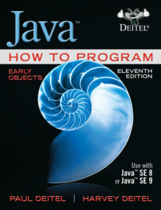

# Java-Learning-Archive

**This repository contains different materials for learning and improving Cpp skills.**

# List of Materials

* [Java How to Program 11 edition](./JavaHowtoProg/README.md)

> You can follow with same sequence

## Books

## Good Resource Links

* [Java Code Formats](https://github.com/google/google-java-format)
* [How to Navigate In Docs](https://youtu.be/ULEOb8wLa_k)
* [Java Annotations](https://docs.oracle.com/javase/tutorial/java/annotations/)
* [Java Error vs Exception](https://www.geeksforgeeks.org/errors-v-s-exceptions-in-java/)